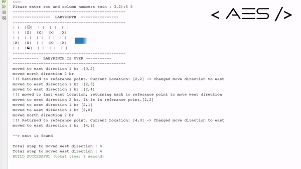
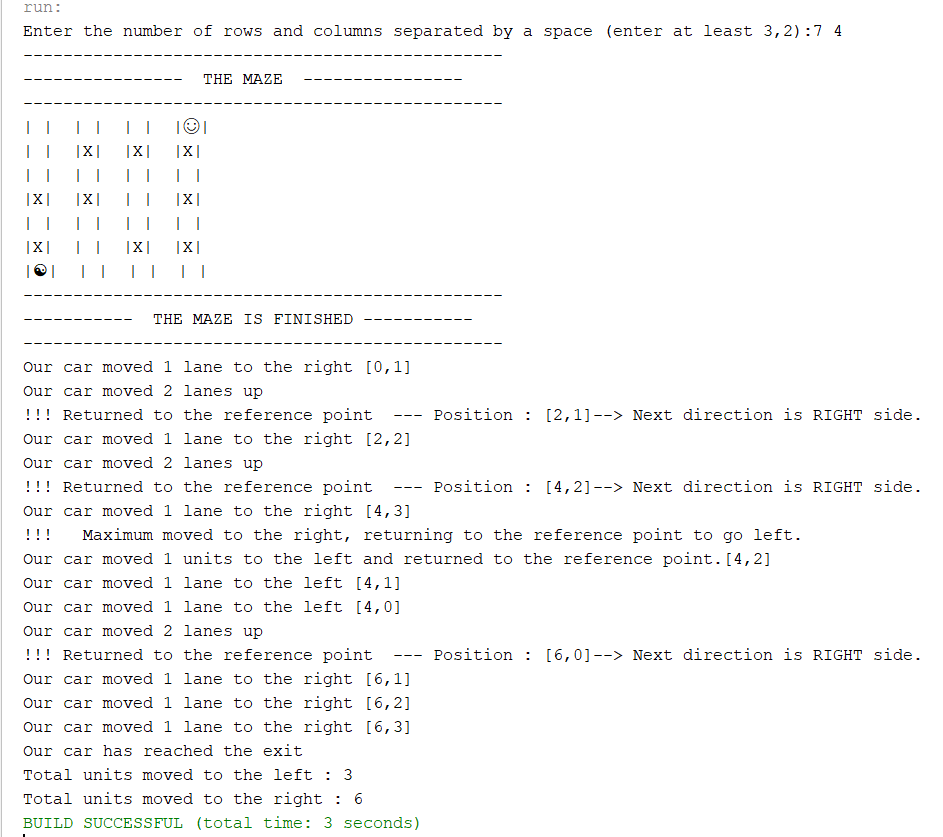
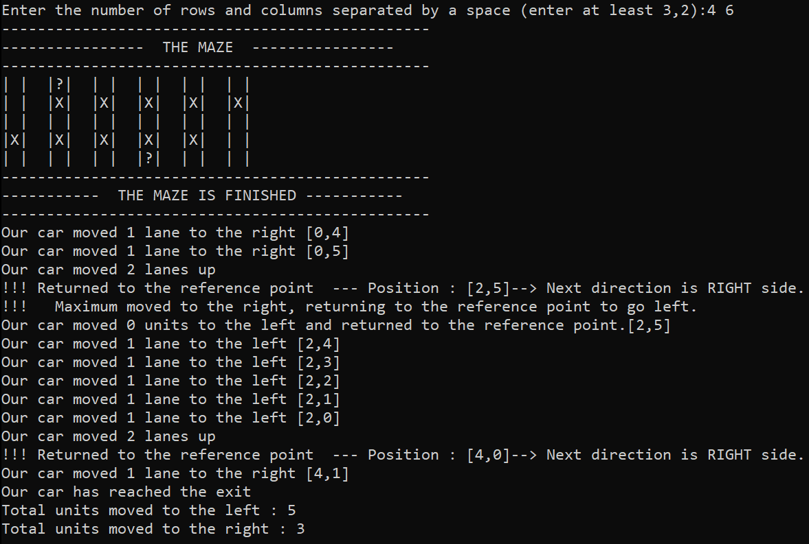
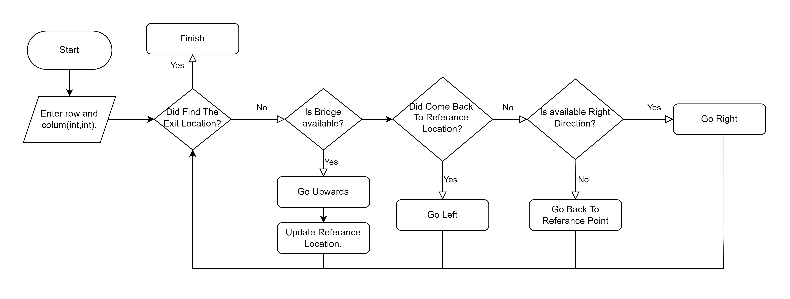

<h1><i>PathFinder-1</i> </h1>


<h2>Content</h2>
<ul>
        <li><a href="#about-project">1-) About The Project</a></li>
        <li><a href="#why-project-created">2-) Why The Project Is Created?</a></li>
        <li><a href="#used-technologies">3-) Used Technologies </a></li>
        <li><a href="#images">4-) Images </a>
                <ul> 
                        <li><a href="#gif">A-) GIF</a></li>
                        <li><a href="#netbeans-output">B-) Netbeans Output</a></li>
                        <li><a href="#windows-cmd-output">C-) Windows Cmd Output</a></li>
                </ul>
        </li>
        <li><a href="#video-links">5-) Video Links</a></li>
        <li><a href="#workflow">6-) Workflow</a></li>
        <li><a href="#requirement">7-) Requirements</a></li>
        <li><a href="#quick-start">8-) Quick Start</a></li>
        <li><a href="#installation">9-) Installation</a></li>
        
</ul>

<h2 id="about-project">1-) About The Project</h2>
The project aims to generate a random maze with a correct path from the start location to the exit location. This maze includes random bridges that allow the car/robot to move to the upper row in the maze. The car/robot has a random start location in the maze's lowest row, and its purpose is to move along the correct path to reach the exit.
<br>

<h2 id="why-project-created">2-) Why The Project Is Created?</h2>
The project was created to improve algorithm skills in 2019 (first year at University). 

<h2 id="used-technologies">3-) Used Technologies</h2>

* Java SE
* Netbeans

<h2 id="images">4-) Images </h2>

<ul> 
        <li>
<h3 id="gif">A-) GIF</h3>


        <br><br></li>
        <li>
<h3 id="netbeans-output">B-) Netbeans Output </h3>


        <br><br></li>
        <li>
<h3 id="windows-cmd-output">C-) Windows Cmd Output </h3>


       </li>
        
</ul>
<!-- -> <h2 id="gif">GIF</h2>
->
<!-- -->

<!-- <h2 id="netbeans-output"> Netbeans Output</h2>


<h2 id="windows-cmd-output"> Windows Cmd Output </h2>


-->


<br>
<h2 id="video-links">5-) Video Links</h2>

* <a href="https://www.youtube.com/watch?v=Ry_n_0eYv3Y"> Youtube Link </a>
* <a href="https://www.linkedin.com/posts/ahmeteminsaglik_java-algorithm-algorithms-activity-7064986513301749761-bvRb/?utm_source=share&utm_medium=member_desktop"> Linkedin Link </a>


<h2 id="workflow">6-) Workflow?</h2>
The flowchart below provides a brief overview of the program.
<br><br>




<h2 id="requirement">7-) Requirements</h2>

The project can run `JDK 1.8+`

<h2 id="quick-start">8-) Quick Start</h2>

1-) Copy and paste the following command in your cmd. 
```
git clone https://github.com/AhmetEminSaglik/PathFinder-1.git
```
3-) Then copy and paste the following command in your cmd. 
```
 java -jar  PathFinder-1/dist/AES_Robot_1.jar
```

<h2 id="installation">9-) Installation </h2>

1-) Install these :
<br>
* <a href="https://www.oracle.com/java/technologies/downloads/#java8">Java SE Development Kit 8 (JDK 8)</a>
* After installing JDK 8, install <a href="https://netbeans.apache.org/front/main/download/index.html">NetBeans IDE</a> or <a href="https://www.jetbrains.com/idea/download/?section=windows"> Intelij Idea Community Edition</a>

2-) Copy and paste the following command in your cmd. 
```
git clone https://github.com/AhmetEminSaglik/PathFinder-1.git
```

3-) Open IDE, and open the cloned project.

4-) The project is ready to run.
